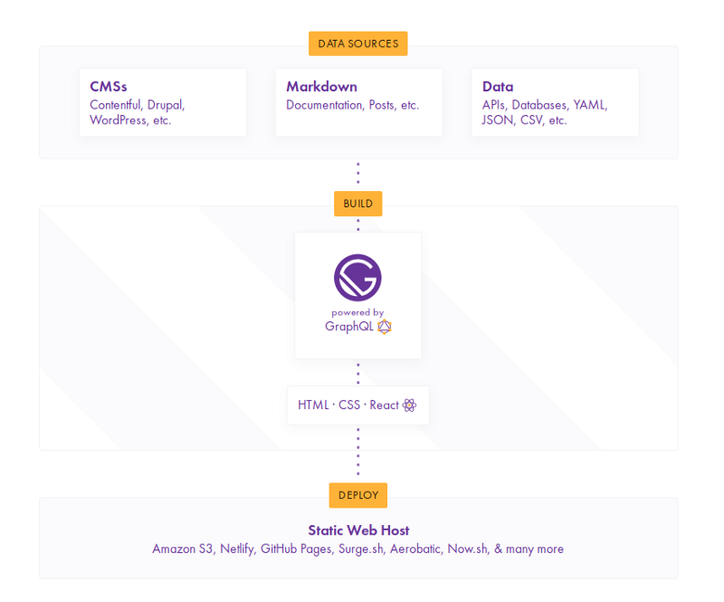

Our website, including this blog was built on GatsbyJS. It took us about 10-15 minutes to deploy the website and the rest of the time we were fixing the content for the website. So we thought, why not kickstart our blog *aka inbound marketing*, with GatsbyJS (hopefully, there is better content after this 🤞).

## What is GatsbyJS?

GatsbyJS is a site generator for React. 

*Everyone: What is a static site generator?*

In the early days of the web, people used to build their websites in HTML, CSS and JS (yep!), and you could open these pages directly from your file system.

*Everyone: So, why did we abandon these gold nuggets?*

Well, not everyone is as enthusiastic as us to build sites from scratch. Now consider, each time you had to write a blog and you had to rewrite the same code over and over again...was pretty annoying and people wanted a quick go to solution to get over this problem. 

**Content Management System has entered the chat**

With the rise of CMS like Wordpress, you didn't have to worry about the technical details you could change the design, layout on how your website looked with a few clicks.

*Everyone: So, why are we bringing back this site generator?*

Good question.

## Why are we using GatsbyJS?

Considering our own case:

- From the perspective of a user: we are addicted to performance, great design and giving our readers/visitors a great experience. 

- From a technical perspective: We love React.js (duh!). Our team, always wants to update some text on the fly and so we wanted a solution to update really quickly, so we wanted quick deployment with each commit. In addition to that, for the blog we wanted to use Markdown (aka real programmers 🙈). 

Turns out, GatsbyJS is the perfect solution that we are looking for.

1. They support Markdown! 😍

2. They have Netlify, with which you can deploy with each commit.

3. They use React 🥰

*Everyone: What else can GatsbyJS do?*

If you observe the image, where we described how GatsbyJS works, you can observe that you can use **Data** (APIs, Databases etc.,). So you definitely can build web apps using GatsbyJS. For this blog we are limiting to a static website 

*(Share this article if you want that!) continuing...* 

## Let's Build!

1. **Templates**: GatsbyJS has a very good set of templates. That you can check here https://www.gatsbyjs.org/starters/. *Everyone: That's cheating!*. Totally!

2. For our use case, we have picked <a href="https://www.gatsbyjs.org/starters/codebushi/gatsby-starter-dimension/" target="_blank">this</a>. It's a portfolio template and the <a href="https://gatsby-dimension.surge.sh/" target="_blank">demo</a> looks pretty slick.

3. Now, let's deploy

If you see

there is an option on the gatsby <a href="https://www.gatsbyjs.org/starters/codebushi/gatsby-starter-dimension/" target="_blank">page</a> to deploy to Netlify directly, we are going to use that.

4. If you have a Netlify account *kudos!*. If not, no problem! Netlify has a free option. Allow Netlify to use your gitlab or other git account.

5. In a while, Netlify should be deploying your website.

6. Now, if you check your git account there should a repository of your website.

7. Pull it locally and make any required changes as you would like to in the content.

8. *Tada!*. Done in less than an hour and now every time you push any changes on the `master` branch, Netlify will handle deploying your website.

That's it folks!

