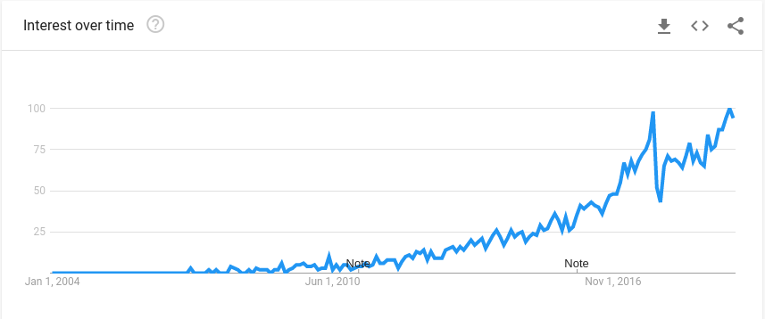
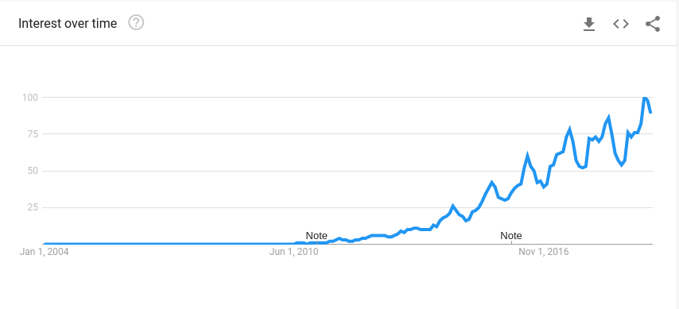
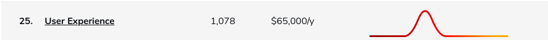
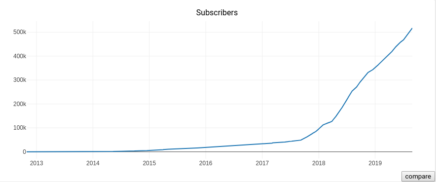
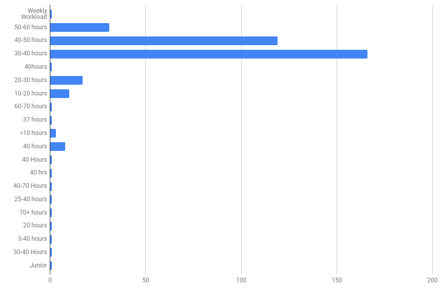
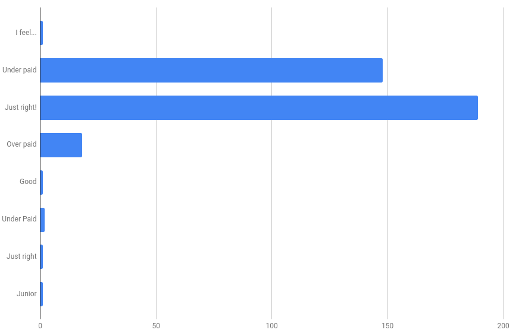
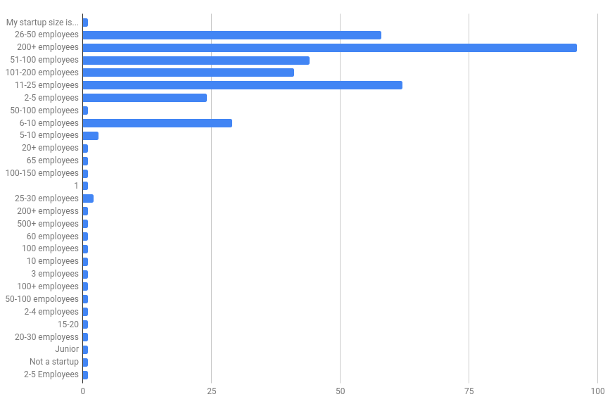

In this blog, we wanted to shift our perspective a bit from tech to people behind the tech. A growing tribe of people who are transitioning from their traditional 9-5 jobs to a remote lifestyle, travelling and working from coffee shops, co-working spaces and go by the name **digital nomads**.

## Who are digital nomads?

So far from our description of digital nomads, they seem to be living the life.

*How are digital nomads able to work remotely?*

Indeed, how did they crack the code to a good life?

## How are digital nomads able to work remotely?

Most digital nomads have a **financial cushion**. They move to a country where it's cheaper for them to sustain and explore those peacefully, without worrying much about the finance.

A good correlation to this is how co-working spaces, and services like Airbnb have seen an uptick as well.

- Google search trends for [airbnb]((https://trends.google.com/trends/explore?date=all&q=airbnb)).

- Google search trends for [co-working spaces](https://trends.google.com/trends/explore?date=all&q=co-working%20space).

*What kind of work do they do?*

A lot of the work digital nomads do today is **knowledge work**, which can be done through a laptop and a mobile internet. A few examples would be: Virtual Assistant, IT, Sales, Transcription, Design, Accounting, Customer Service.

*Are there no visa issues for digital nomads?*

There are many countries that digital nomads can visit as a tourist and work. Few countries also support digital nomads like Estonia.

- [Estonia]((https://e-estonia.com/digital-nomads-visa-shape-urban-employment)) offers a digital nomad to allow and digital nomad to come and liveby.

- [Germany](https://www.germany-visa.org/freelance-visa/) has a freelancer visa.
- [Australia](https://visagroup.com.au/digital-nomads-australian-tourist-visa/) offers a visa
- [Costa Rica](http://www.costarica-embassy.org/index.php?q=node/72)
- [Thailand](https://www.thaiembassy.sg/visa-matters-/-consular/types-of-visa/tourist-visa)
- [Portugal](https://www.quora.com/What-visas-can-digital-nomads-get-in-Portugal)
- [Czech Republic](https://www.google.com/url?q=https://www.expat.com/en/guide/europe/czech-republic/16419-become-a-digital-nomad-in-the-czech-republic.html&sa=D&ust=1567256052666000)

*So how does one find remote work?*

There are bunch of websites dedicated for remote work some of those are:
- [Wework Remotely](https://weworkremotely.com/#job-listings)
- [Remote ok](https://remoteok.io/)
- [Remote](https://remote.com/)
- [Remoteco](https://remote.co/)
- [Flex Jobs](https://www.flexjobs.com/)
- [Just remote](https://justremote.co/)
- [Remotive](https://remotive.io/)
- [Working nomads](https://www.workingnomads.co/jobs)
- [Jobspresso](https://jobspresso.co/)
- [Europe Remotely](https://europeremotely.com/)
- [Outsourcely](https://www.outsourcely.com/remote-workers)

Clearly, there is no shortage of resources to find remote work, but not all jobs are more favorable for remote work. You can check some of the stats [here](https://remoteok.io/remote-work-statistics).

Something quite surprising was the unusual peak and fall in remote work for User experience.

and then for game developers, initially it seemed more favorable for remote, but has been dipping.

*How many people are working remotely?*

To find that out, we wanted to see since when has this trend started to catch up. Where better to understand the community, but [reddit](https://reddit.com/r/digitalnomad).

We decided to check the trends for digital nomad subreddit.

The graph definitely doesn't indicate that there are ~400k digital nomads in 2019, but that there are certainly a lot number of people interested in working remotely.

An important question to ask is how most digital nomads feel regarding their work and whether they find the pay satisfactory or not?

*Note: the current stats mentioned below are based from [Remotive.io](https://docs.google.com/spreadsheets/d/1VOehQv0bOs2pY7RkKJ8RmlUbuu8UmSgzfvjR0m5hyxQ/edit#gid=1145296357).*

**Workload**

What is the weekly workload for digital nomads?

Knowledge work shouldn't be calculated in hours, but most digital nomads seem to have **equal if not more workload than the usual 9-5 jobs**. IT workers on average have a 52 hour workweek, so seems pretty close to it.

**Salary Compensation**

How do digital nomads feel regarding their salaries?

Seems on an average digital nomads are very likely to feel their salaries are **just right or underpaid**.

**Startup size**

What is the startup size like where remote workers work?

So it's more likely that companies of employee size **200+ are more likely** to hire remote workers.

## Future of work?

*What does the overall future look like for both digital nomads and the traditional workers?*

Many companies acknowledge that future of work is definitely going to be remote. There is also the *gig economy* where people are offering small services (like hosting your website) for a fixed price and within a fixed time, which is also going to be part of the future.

A lot of the work where interaction and access to resources are an obligation would more likely stay the way they currently are. This is also dependent on companies as well.

Traditional work may be translated from 5-day work week to [4-day work week!](https://www.portcullislegals.co.uk/wills-estate-administration/four-day-week/) 😎.

## Conclusion

1. If you are planning on becoming a digital nomad, do your research and have a financial pillow before you make that plunge.

2. Know the visa issues about the countries before you visit them.

3. Enjoy the travel!

